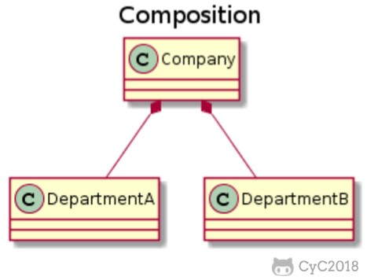
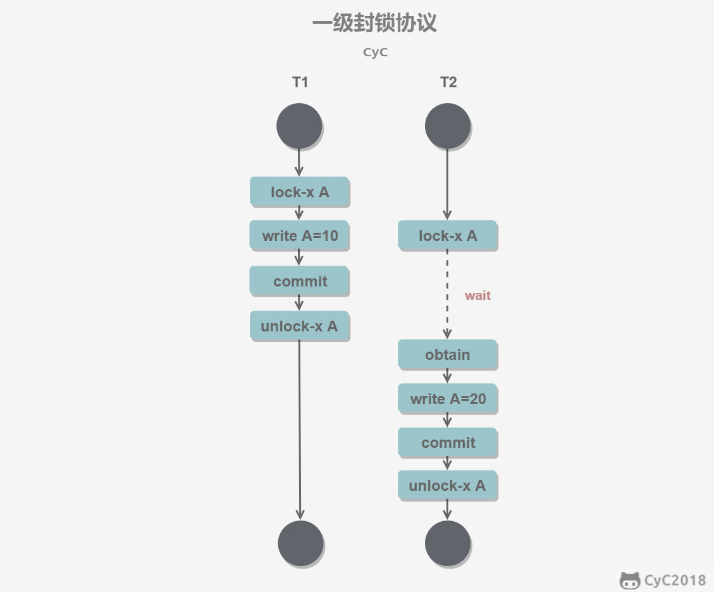

# Java编程语言
## Java语言基础
### 继承
#### 概念
+ 继承指的是子类继承父类的特征和行为，使得子类对象（实例）具有父类的实例域和方法，或者子类从父类继承方法，使得子类具有父类相同的行为
#### 继承的方式和作用
+ extends关键字实现子类继承父类
+ 具有父类当中的属性和方法，子类就不会存在重复的代码，维护性也提高，代码也更加简洁，提高代码的复用性（复用性主要是可以多次使用，不用再多次写同样的代码）
#### 继承规则
+ Java 的继承是单继承，但是可以多重继承，单继承就是一个子类只能继承一个父类，多重继承就是，例如 A 类继承 B 类，B 类继承 C 类，所以按照关系就是 C 类是 B 类的父类，B 类是 A 类的父类，这是 Java 继承区别于 C++ 继承的一个特性。

+ 子类拥有父类非 private 的属性、方法
+ 类可以拥有自己的属性和方法，即子类可以对父类进行扩展
#### 继承相关的关键字
  继承可以使用extends和implements这两个关键字来实现继承，而且所有的类都是继承于java.lang.Object，当一个类有继承的两个关键字，则默认继承Object类
+ **extends**: 在 Java 中，类的继承是单一继承，也就是说，一个子类只能拥有一个父类，所以 extends 只能继承一个类
```java
public class Animal {
    private String name;
    private int id;
    public Animal(String myName, String myid) {
        //初始化属性值
    }
    public void eat() {  //吃东西方法的具体实现  }
    public void sleep() { //睡觉方法的具体实现  }
}

public class Penguin  extends  Animal{
}
```
+ **implements**: 使用implements关键字可以变相的使Java具有多继承的特性，使用范围为类继承接口的情况，可以同时继承多个接口（接口与接口之间用“，”隔开）
```java
public interface A {
    public void eat();
    public void sleep();
}

public interface B {
    public void show();
}

public class C implements A,B {
}
```
+ **super与this关键字**：我们可以通过super关键字来实现对父类成员的访问，用来引用当前对象的父类；this是指向自己的引用。
```java
class Animal {
  void eat() {
    System.out.println("animal : eat");
  }
}

class Dog extends Animal {
  void eat() {
    System.out.println("dog : eat");
  }
  void eatTest() {
    this.eat();   // this 调用自己的方法
    super.eat();  // super 调用父类方法
  }
}
```
+ **final关键字**：final声明类可以把类定义为是不能继承的，即最终类；或者用于修饰方法，表示该方法不能被子类重写
  + 数据: 声明数据为常量;
    + 对于**基本类型**,final使数值不变
    + 对于**引用类型**，final使引用不变，也就不能引用其他对象，但是被引用的对象本身是可以修改的
  + 方法：声明方法不能被子类重写
  + 类：　声明的类不能被继承
+ **static关键字**
  + **静态变量**
    + 静态变量：又称类变量，也就是说这个变量是属于类的，类所有的实例都共享静态变量，*可以直接通过类名来访问它*．静态变量只会被实例化一次，所以在内存中只存在一份
    + 实例变量：每创建一个实例，就会产生一个实例变量，它与实例同生共死．
  + **静态方法**: 静态方法必须有实现，也就是说它不能是抽象的方法；只能访问所属类的静态变量或者静态方法，方法中不能有this和super这两个关键字与具体的对象关联
  + **静态语句块**: 在类初始化是只运行一次
  + **静态内部类**: 非静态内部类依赖于外部类的实例，也就是说需要先创建外部类的实例，才能用这个实例去创建非静态类；而静态内部类不需要，可以直接进行创建　
  + **初始化顺序**: 存在继承的情况下
    + 父类（静态变量，静态语句块）
    + 子类（静态变量，静态语句块）
    + 父类（实例变量，普通语句块）
    + 父类（构造函数）
    + 子类（实例变量，普通语句块）
    + 子类（构造函数）
```Java
pubilc class A(){
    private int x; //实例变量
    private static int y; //静态变量
    pubilc static void main(String[] args){
      A a = new A();
      int x = a.x;

      int y = A.y;//可以直接通过类名来访问它
    }

}

public class outClass{

    class inClass{

    }

    static class StaticInClass{

    }

    pubilc static void main(String[] args){

      //创建非静态类必须依赖与外部类
      outClass out = new outClass();
      inClass in = out.new inClass();

      //静态内部类直接可以进行创建
      StaticInClass staticin = new StaticInClass();

    }

}

```

+ **构造器（构造方法或者构造函数）**: 子类是不继承父类的构造器（构造方法或者构造函数）的，它只是调用（隐式或显式）。
  + **如果父类的构造器带有参数**，则必须在子类的构造器中显式地通过 **super** 关键字调用父类的构造器并配以适当的参数列表;
  + **如果父类构造器没有参数**，则在子类的构造器中不需要使用 super 关键字调用父类构造器，系统会自动调用父类的无参构造器
```java
class SuperClass {
  private int n;
  SuperClass(){
    System.out.println("SuperClass()");
  }
  SuperClass(int n) {
    System.out.println("SuperClass(int n)");
    this.n = n;
  }
}
// SubClass 类继承
class SubClass extends SuperClass{
  private int n;

  SubClass(){ // 自动调用父类的无参数构造器
    System.out.println("SubClass");
  }

  public SubClass(int n){
    super(300);  // 调用父类中带有参数的构造器
    System.out.println("SubClass(int n):"+n);
    this.n = n;
  }
}
// SubClass2 类继承
class SubClass2 extends SuperClass{
  private int n;

  SubClass2(){
    super(300);  // 调用父类中带有参数的构造器
    System.out.println("SubClass2");
  }

  public SubClass2(int n){ // 自动调用父类的无参数构造器
    System.out.println("SubClass2(int n):"+n);
    this.n = n;
  }
}
```
### Java 重写(Override)与重载(Overload)
####  重写(Override)
+ 重写是子类对父类的允许访问的方法的实现过程进行重新编写，**返回值和形参都不能改变**(返回值只能相同或者是派生类)
+ 重写的好处在于子类可以根据需要，定义特定于自己的行为
+ 重写方法不能抛出新的检查异常或者比被重写方法申明更加宽泛的异常。*例如： 父类的一个方法申明了一个检查异常 IOException，但是在重写这个方法的时候不能抛出 Exception 异常，因为 Exception 是 IOException 的父类，只能抛出 IOException 的子类异常*。
#### 重写的规则
+ 参数列表必须完全与被重写的方法相同
+ 返回类型与被重写方法的返回类型可以不相同，但是必须是父类返回值的派生类
+ 访问权限不能比复父类中被重写的方法访问权限更低。***例：声明为 public，那么在子类中重写该方法就不能声明为 protected***
+ 声明为 final 的方法不能被重写；声明为 static 的方法不能被重写，但是能够被再次声明
+ 子类和父类在同一个包中，那么子类可以重写父类所有方法，除了声明为 private 和 final 的方法；子类和父类不在同一个包中，那么子类只能够重写父类的声明为 public 和 protected 的非 final 方法
+ 构造方法不能被重写
+ 当需要在子类中调用父类的被重写的方法，要使用**super**关键字
#### 重载（overload)
+ 重载是指在**同一个类**中，方法名相同，而参数不同。返回的类型可以相同也可以不同。
+ 每个重载方法都必须有一个独一无二的参数类型列表
#### 重载的规则
+ 被重载的方法必须改变参数列表
+ 被重载的方法可以改变返回类型
+ 被重载的方法可以改变访问修饰符
+ 方法能够在同一个类中或者在一个子类中被重载
#### 重写与重载之间的区别
  方法的重写(Overriding)和重载(Overloading)是java多态性的不同表现，重写是父类与子类之间多态性的一种表现，重载可以理解成多态的具体表现形式。
+ (1)方法重载是一个类中定义了多个方法名相同,而他们的参数的数量不同或数量相同而类型和次序不同,则称为方法的重载(Overloading)。
+ (2)方法重写是在子类存在方法与父类的方法的名字相同,而且参数的个数与类型一样,返回值也一样的方法,就称为重写(Overriding)。
+ (3)方法重载是一个类的多态性表现,而方法重写是子类与父类的一种多态性表现。


### 多态
#### 概念
+ 多态是同一个行为具有多个不同表现形式或形态的能力。多态就是同一个接口，使用不同的实例而执行不同操作，意味着不同类的对象对同一消息做出不同的响应，随着父类在程序运行时实例化的对象不同，执行的行为不同。
#### 分类
+  1、编译时多态：设计时多态方法重载
+  2、程序运行时动态决定调用哪一个方法(JAVA中的多态)
#### 必要条件
+ 1、满足继承关系
+ 2、父类引用指向子类对象(向上转型)
+ 3、重写
#### 相关知识
+ **向上转型**（父类--->子类）（隐式转型、自动转型）：把子类的对象转型为父类对象，父类引用指向子类实例（例：Animal one = new Cat();）。可以调用子类重写父类的方法以及父类派生的方法，但无法调用子类独有的方法。（***注意：如果父类中有static修饰的方法，此方法是不允许被子类所重写，所以，向上转型之后，只能调用父类原有的静态方法，如果要调用子类的静态方法，只有再进行向下***）
+ **向下转型**（强制类型转换）：子类的引用指向父类对象，可以调用子类特有的方法。( 例：Cat temp = (Cat) one;）。
+ **instanceof判断符**：判断左边的对象是否是右边类的实例，如果是就返回true（例：if（one instanceof Cat) )。
#### 多态的实现方式
+ 重写
+ 接口
+ 抽象类和抽象方法
### 抽象类和抽象方法（abstract)
#### 抽象类
+ 在面向对象的概念中，所有的对象都是通过类来描绘的，但是反过来，并不是所有的类都是用来描绘对象的，如果一个类中没有包含足够的信息来描绘一个具体的对象，这样的类就是抽象类
+ ***抽象类不能直接实例化***，只能被继承，可以通过向上转型完成对象的实例化
+ 抽象类除了不能实例化对象之外，类的其它功能依然存在，成员变量、成员方法和构造方法的访问方式和普通类一样。
+ 由于抽象类不能实例化对象，所以抽象类必须被继承，才能被使用。也是因为这个原因，通常在设计阶段决定要不要设计抽象类。
#### 抽象方法
+ 如果你想设计这样一个类，该类包含一个特别的成员方法，该方法的具体实现由它的子类确定，那么你可以在父类中声明该方法为抽象方法
+ 不允许包含方法体：public obstract void eat();
+ 抽象类的子类必须给出抽象类中的抽象方法的具体实现，除非该子类也是抽象类。***注：这就是为什么需要定义抽象类和抽象方法，可以在创建子类时提示一定要重写父类里的某些抽象方法，不然就报错）***
+ 包含抽象方法的类一定是抽象类
+ *** 注：static 、final 、private不能与abstract并存,构造方法，类方法（用 static 修饰的方法）不能声明为抽象方法***
### 封装
#### 概念
+ 在面向对象程式设计方法中，封装（英语：Encapsulation）是指一种将抽象性函式接口的实现细节部分包装、隐藏起来的方法。
+ 封装可以被认为是一个保护屏障，防止该类的代码和数据被外部类定义的代码随机访问。
+ 要访问该类的代码和数据，必须通过严格的接口控制。
+ 封装最主要的功能在于我们能修改自己的实现代码，而不用修改那些调用我们代码的程序片段。
+ 适当的封装可以让程式码更容易理解与维护，也加强了程式码的安全性。
#### 使用
+ 修改属性的可见性来限制对属性的访问（一般限制为private）
+ 对每个值属性提供对外的公共方法访问，也就是创建一对赋取值方法，用于对私有属性的访问***(创建getter和setter方法, 任何要访问类中私有成员变量的类都要通过这些getter和setter方法。)***
### 接口（interface）
+ 接口在java程序中是一个抽象类型，是抽象方法的集合，通常用interface来声明。一个类通过继承接口的方式来继承接口的抽象方法。
+ 接口并不是类，编写接口的方式和类很相似，但是它们属于不同的概念。类描述对象的属性和方法。接口则包含类要实现的方法。
+ 除非实现接口的类是抽象类，否则该类要定义接口中的所有方法。
+ 接口无法被实例化，但是可以被实现。一个实现接口的类，必须实现接口内所描述的所有方法，否则就必须声明为抽象类。
#### 接口与类的区别
+ 接口不能实例化对象
+ 接口没有构造方法
+ 接口中所有方法必须都是抽象方法
+ 接口中不能包含成员变量，***除了  static  和  final 变量***
+ 接口不是被类继承了，而是要被类实现
+ 接口支持多继承
#### 接口的特性
+ 接口中每一个方法也是隐式抽象的,接口中的方法会被隐式的指定为 public abstract（只能是 public abstract，其他修饰符都会报错）。
+ 接口中可以含有变量，但是接口中的变量会被隐式的指定为 public static final 变量（并且只能是 public，用 private 修饰会报编译错误）
+ 接口中的方法是不能在接口中实现的，只能由实现接口的类来实现接口中的方法。
#### 抽象类和接口区别
+ 抽象类中的方法可以有方法体，就是能实现方法的具体特性，但是接口中的方法不行
+ 抽象类中的成员变量可以是各种类型，而接口中的成员变量只能是public static final类型的
+ ***一个类可以继承一个抽象类，但是一个类却可以实现多个接口***
#### 接口的声明
Interface关键字用来声明一个接口
```java
[可见度] interface 接口名称 [extends 其他的接口名] {
        // 声明变量
        // 抽象方法
}
interface Animal {
   public void eat();
   public void travel();
}
```
#### 接口的实现
+ 当类实现接口的时候，类要实现接口中所有的方法。否则，类必须声明为抽象的类。
+ 类使用implements关键字实现接口。在类声明中，Implements关键字放在class声明后面。
```java
...implements 接口名称[, 其他接口名称, 其他接口名称..., ...] ...

public class MammalInt implements Animal{

   public void eat(){
      System.out.println("Mammal eats");
   }

   public void travel(){
      System.out.println("Mammal travels");
   }
}
```
+ 重写接口中声明的方法时，类在重写方法时要保持一致的方法名，并且应该保持相同或者相兼容的返回值类型。
#### 接口的继承
+ 一个接口能继承另一个接口，和类之间的继承方式比较相似。接口的继承使用***extends***关键字，子接口继承父接口的方法
+ 在Java中，类的多继承是不合法，但接口允许多继承,在接口的多继承中extends关键字只需要使用一次，在其后跟着继承接口。
```java
public interface Hockey extends Sports, Event
```
### 修饰符的访问范围
+ private: 只允许在本类中进行访问
+ public: 允许在任意位置进行访问
+ protected: 允许在当前类、同包子类、同包非子类、挎包子类中访问; ***挎包非子类不允许访问***
+ 默认情况下(不加以上三种修饰符之下)：允许在当前类、同包子类调用；***挎包子类不允许使用***


### Java StringBuffer 和 StringBuilder 类
+  当对字符串进行修改时，需要使用StringBuffer和StringBuilder类
+  与String不同的是，StringBuffer和StringBuilder类的对象能够多次被修改，并且不产生新的未使用对象
+  StringBuilder 类和 StringBuffer 之间的最大不同在于 StringBuilder 的方法不是线程安全的（不能同步访问）
+  由于 StringBuilder 相较于 StringBuffer 有速度优势，所以多数情况下建议使用 StringBuilder 类。然而在应用程序要求线程安全的情况下，则必须使用 StringBuffer 类

### Java集合框架
  Java 集合框架主要包括两种类型的容器，一种是集合（Collection），存储一个元素集合，另一种是图（Map），存储键/值对映射。Collection 接口又有 3 种子类型，List、Set 和 Queue，再下面是一些抽象类，最后是具体实现类，常用的有 ArrayList、LinkedList、HashSet、LinkedHashSet、HashMap、LinkedHashMap 等等
+ 接口：是代表集合的抽象数据类型。例如：Collocation、List、Set、Map等。之所以定义多个
+ 实现：是集合接口的具体实现，从本质上讲，它们是可以重复使用的数据结构，例如：ArratList、LinkedList、HashSet、HashMap。


#### 集合接口
+ **Collection接口**: 是最基本的集合接口,存储一组不唯一,无序的对象
+ **List接口**: 是一个有序的Collection
  + ArrayList: 基于动态数组实现,支持随机访问
  + Vector: 和ArrayList类似,但是它是线程安全的
  + LinkList: 基于双向链表实现,只能顺序访问,但是可以快速地在链表中插入和删除元素,同时,还可以用作栈,队列和双向队列
+ **Set接口**: Set具有与Collection完全一样的接口,只是行为上不同,Set不保存重复的元素; Set接口存储一组唯一,无序的对象
  + HashSet: 基于哈希表实现,支持快速查找,查找效率为0(1),但是不支持有序性操作,并且失去了元素的插入顺序信息,也就是说使用Iterator遍历的结果是不确定的
  + LinkedHashSet: 具有HashSet的查找效率,并且内部使用双向链表维护元素的插入顺序.
  + TreeSet: 基于红黑树实现,支持有序性操作,但是查找效率不如HashSet,查找时间复杂度为O(logn).
+ **Queue**:
  + LinkedList: 用来实现队列
  + PriorityQueue: 基于堆结构(最小堆)实现,可以用来实现优先队列
+ **Map接口**: 存储一组键值对象,提供Key(键)到value(值)的映射
  + HashMap: 基于哈希表实现
  + TreeMap: 基于红黑树实现
  + HashTable: 和HashMap类似,但是它是线程安全的,这意味着同一时刻多个线程同时写入HashTable不会导致数据不一致.
#### Set与List的区别
+ Set接口实例存储的是无序的,不重复的数据; List接口实例存储的是有序的,可以重复的数据
+ Set检索效率低下,删除和插入效率高,插入和删除不会引起元素位置的改变 **(实现类有HashSet和TreeSet)**
+ List和数组类似,可以动态增长,根据实际存储的数据长度自动增长List长度.查找元素效率高,插入删除效率低,因为会引起其他元素位置改变 **(实现类有ArrayLIst, LinkedList, Vector)**
#### 常用的集合类
+ ***List结构的集合类***: ArrayList类, LinkedList类, Vector类, Stack类
+ ***Map结构的集合类***: HashMap类, Hashtable类
+ ***Set结构的集合类***: HashSet类, TreeSet类
+ ***Queue结构的集合类***: Queue接口
#### 集合实现类(集合类)
+ ***LinkedList类***:
	+ 该类实现了List接口,允许有null元素.主要用于创建链表数据结构
	+ ***LinkedList的底层是一种双向循环链表***, LinkedList查找效率低但是增删效率高;
	+ 经常用在增删操作较多而查询操作很少的情况下：队列和堆栈 (实现栈要用LinkedList)
	+ 该类没有同步方法,如果多个线程同时访问一个List,则必须自己实现访问同步,解决方案是在创建List时候构造一个同步的List.例如:
```java
List list = Collections.synchronizedList(new LinkedList(...))
```
+ ***ArrayList***:
	+ 该类实现了List的接口,实现可变大小的数组,随机访问和遍历元素时,提供更好的性能;
	+ ArrayList是异步的，因此ArrayList中的对象并不 是线程安全的;
	+ ***底层是Object数组***,所以ArrayList具有数组的查询速度快的优点以及增删速度慢的缺点;
	+ 同步要求会影响执行的效率，所以你不需要线程安全的集合那么使用ArrayList是一个很好的选择，这样可以避免由于同步带来的不必要的性能开销
+ ***Vector***:
	+ 该类与ArrayList非常相似,但是该类是同步的,可以用在多线程的情况下,该类允许设置默认的增长长度,默认扩容方式为原来的2倍
	+ Vector是同步的，这个类的一些方法保证了Vector中的对象的线程安全的
	+ 从内部实现的机制来讲，ArrayList和Vector都是使用数组（Array）来控制集合中的对象，当你向两种类型中增加元素的时候，如果元素的数目超过了内部数组目前的长度他们都需要扩展内部数组的长度，Vector缺省情况下自动增长原来一倍的数组长度，ArrayList是原来的50%，所以最后你获得的这个集合所占的空间总是比你实际需要的要大，所以如果你要在集合中保存大量的数据，那么使用Vector有一些优势，因为你可以通过设置集合的初始大小来避免不必要的资源开销
+ ***HashSet***:
	+ 采用哈希算法来实现Set接口
	+ 该类实现了Set接口,不允许重复的元素出现,不保证集合元素的顺序,允许包含值为null的元素,但最多只能包含一个
	+ 底层是数组,其查询效率也非常高
+ ***LinkedHashSet***: 具有可预知迭代顺序的Set接口的哈希表和链表实现
+ ***HashMap***:
	+ 是一个散列表,它存储的内容是键值对映射(Key-Value);
	+ 该类实现了Map接口,根据键的HashCode值存储数据,具有很快的访问速度,最多允许一个记录的键为null
	+ 轻量级,线程不安全,不支持多线程.HashMap则是异步的，因此HashMap中的对象并不是线程安全的;
	+ 同步的要求会影响执行的效率，所以如果你不需要线程安全的结合那么使用HashMap是一个很好的选择，这样可以避免由于同步带来的不必要的性能开销，从而提高效率，我们一般所编写的程序都是异步的
+ ***Hashtable***:
	+ 重量级,线程安全,Hashtable是同步的，这个类中的一些方法保证了Hashtable中的对象是线程安全的
	+ Hashtable是不能放入空值（null）的

+ ***Stack***: 栈是Vector的一个子类,它实现了一个标准的先进后出的栈
#### 如何使用迭代器(Iterator)
+ 通常情况下，你会希望遍历一个集合中的元素。例如，显示集合中的每个元素。
+ 一般遍历数组都是采用for循环或者增强for，这两个方法也可以用在集合框架，但是还有一种方法是采用迭代器遍历集合框架，它是一个对象，实现了Iterator 接口或ListIterator接口。
+ 迭代器，使你能够通过循环来得到或删除集合的元素。
```java
Iterator<String> ite=list.iterator();
while(ite.hasNext())//判断下一个元素之后有值
{
	System.out.println(ite.next());
}
```
#### 总结
+ ArrayList: 元素单个，效率高，多用于查询
+ LinkedList:元素单个，多用于插入和删除
+ HashMap:   元素成对，元素可为空
+ HashTable: 元素成对，线程安全，元素不可为空
+ Vector:    元素单个，线程安全，多用于查询
+ 如果要求线程安全，使用Vector，Hashtable
+ 如果不要求线程安全，使用ArrayList，LinkedList，HashMap
+ 如果要求键值对，则使用HashMap，Hashtable
+ 如果数据量很大，又要求线程安全考虑Vector


+ 这里再看几篇链接阅读:
  + https://github.com/CyC2018/CS-Notes/blob/master/notes
  + https://www.jianshu.com/p/75adf47958a7
  + http://www.zhangchangle.com/2018/02/07/Java%E9%9B%86%E5%90%88%E4%B9%8BHashMap/


### Java泛型
	  假定我们有这样一个需求：写一个排序方法，能够对整型数组、字符串数组甚至其他任何类型的数组进行排序，该如何实现？答案是可以使用 Java 泛型。
	  使用 Java 泛型的概念，我们可以写一个泛型方法来对一个对象数组排序。然后，调用该泛型方法来对整型数组、浮点数数组、字符串数组等进行排序。
#### 泛型方法
你可以写一个泛型方法，该方法在调用时可以接收不同类型的参数。根据传递给泛型方法的参数类型，编译器适当地处理每一个方法调用。下面是定义泛型方法的规则：
+ 所有泛型方法声明都有一个类型参数声明部分（由尖括号分隔），该类型参数声明部分在方法返回类型之前（在下面例子中的<E>）。
+ 每一个类型参数声明部分包含一个或多个类型参数，参数间用逗号隔开。一个泛型参数，也被称为一个类型变量，是用于指定一个泛型类型名称的标识符。
+ 类型参数能被用来声明返回值类型，并且能作为泛型方法得到的实际参数类型的占位符。
+ 泛型方法体的声明和其他方法一样。注意类型参数只能代表引用型类型，不能是原始类型（像int,double,char的等）。
```java
public class GenericMethodTest
{
   // 泛型方法 printArray
   public static < E > void printArray( E[] inputArray )
   {
      // 输出数组元素
         for ( E element : inputArray ){
            System.out.printf( "%s ", element );
         }
         System.out.println();
    }

    public static void main( String args[] )
    {
        // 创建不同类型数组： Integer, Double 和 Character
        Integer[] intArray = { 1, 2, 3, 4, 5 };
        Double[] doubleArray = { 1.1, 2.2, 3.3, 4.4 };
        Character[] charArray = { 'H', 'E', 'L', 'L', 'O' };

        System.out.println( "整型数组元素为:" );
        printArray( intArray  ); // 传递一个整型数组

        System.out.println( "\n双精度型数组元素为:" );
        printArray( doubleArray ); // 传递一个双精度型数组

        System.out.println( "\n字符型数组元素为:" );
        printArray( charArray ); // 传递一个字符型数组
    }
}

```

#### 泛型类
泛型类的声明和非泛型类的声明类似，除了在类名后面添加了类型参数声明部分。和泛型方法一样，泛型类的类型参数声明部分也包含一个或多个类型参数，参数间用逗号隔开。一个泛型参数，也被称为一个类型变量，是用于指定一个泛型类型名称的标识符。因为他们接受一个或多个参数，这些类被称为参数化的类或参数化的类型。
```java
public class Box<T> {

  private T t;

  public void add(T t) {
    this.t = t;
  }

  public T get() {
    return t;
  }

  public static void main(String[] args) {
    Box<Integer> integerBox = new Box<Integer>();
    Box<String> stringBox = new Box<String>();

    integerBox.add(new Integer(10));
    stringBox.add(new String("菜鸟教程"));

    System.out.printf("整型值为 :%d\n\n", integerBox.get());
    System.out.printf("字符串为 :%s\n", stringBox.get());
  }
}
```
#### 类型通配符
类型通配符一般是使用?代替具体的类型参数。例如 List<?> 在逻辑上List<String>,List<Integer> 等所有List<具体类型实参>的父类
```java
import java.util.*;

public class GenericTest {

    public static void main(String[] args) {
        List<String> name = new ArrayList<String>();
        List<Integer> age = new ArrayList<Integer>();
        List<Number> number = new ArrayList<Number>();

        name.add("icon");
        age.add(18);
        number.add(314);

        getData(name);
        getData(age);
        getData(number);

   }

   public static void getData(List<?> data) {
      System.out.println("data :" + data.get(0));
   }
}

```

## 常见的设计模式及Java实现
### 设计原则
+ **单一责任原则**: 一个类只负责一件事情,当这个类要做过多的事情过后,就需要分解这个类
  如果一个类承担的职责过多,就等于把这些职责耦合起来了,一个职责的变化可能会削弱这个类完成其它职责的能力
+ **开放封闭原则**: 类应该对扩展开放,对修改关闭.扩展的意思就是添加新功能的意思,因此该原则要求在添加新功能时不需要修改代码.
+ **里氏替换原则**: 子类必须能够替换掉所有的父类对象. 继承是一中IS-A的关系,子类需要能够当父类来使用,并且需要比父类更加特殊.如果不满足这个原则,那么各个子类的行为上就会有很大的差异,增加继承体系的复杂度
+ **接口分离原则**: 不应该强迫客户依赖于它们不用的方法. 因此使用多个专门的接口比使用单一的总接口要好
+ **依赖倒置原则**: 高层,模块不应该依赖于低层模块,二者都应该依赖于抽象; 抽象不应该依赖与细节,细节应该依赖与抽象;
高层模块包含一个应用程序中重要的策略选择和业务模块,如果高层模块依赖于低层模块,那么低层模块的改动就会直接影响到高层模块,从而迫使高层模块也需要改动;
### 设计模式简介
#### 概念
+ 设计模式（Design pattern）代表了最佳的实践，通常被有经验的面向对象的软件开发人员所采用。设计模式是软件开发人员在软件开发过程中面临的一般问题的解决方案。这些解决方案是众多软件开发人员经过相当长的一段时间的试验和错误总结出来的。
+ 项目中合理地运用设计模式可以完美地解决很多问题，每种模式在现实中都有相应的原理来与之对应，每种模式都描述了一个在我们周围不断重复发生的问题，以及该问题的核心解决方案，这也是设计模式能被广泛应用的原因。
### 单例模式
#### 概念
+ 单例模式是Java中最简单的设计模式之一.这种类型的设计模式属于创建型模式,它提供了一种创建对象的最佳方式
+ 这种模式涉及到一个的单一的类,该类负责创建自己的对象,同时确保只有的单个对象被创建.
+ 这个类提供了一种访问其唯一的对象的方式,可以直接访问,不需要实例化该类的对象.
####  介绍
+ ***意图***: 保证一个类仅有一个实例, 并且提供一个访问它的全局访问点
+ ***主要解决***: 一个全局使用的类频繁地创建和销毁
+ ***如何解决***: 判断系统是否已经有这个单例,如果有则返回, 如果没有则创建
+ ***关键代码***: 构造函数是私有的
+ ***优点***:
	+ 在内存中只有一个实例,减少了内存的开销,尤其是频繁的创建和销毁实例
	+ 避免对资源的多重占用
+ ***缺点***: 没有接口，不能继承，与单一职责原则冲突，一个类应该只关心内部逻辑，而不关心外面怎么样来实例化
#### 几种实现方式
##### 懒汉式(线程不安全)
+ 这种方式是最基本的实现方式，这种实现最大的问题就是不支持多线程。没有加锁 synchronized，这种方式 lazy loading 很明显，不要求线程安全，在多线程不能正常工作。。
```java
public class SingLeton{
    //创建对象，不实例化
    private static SingLeton instance;
    //构造方法私有
    private SingLeton (){}
    //外部获取该类对象的方法(线程不安全的)
    pubilc static SingLeton getInstance(){
        if(instance == null){
            instance = new SingLeton();
        }
        return instance;
    }
}
```
##### 懒汉式(线程安全)
+ 对公共的getIntanse()函数进行synchronized加锁,那么在同一个时间点只能有一个线程能够进入该方法,从而避免了实例话多次instance
+ 这种方式具备很好的 lazy loading，能够在多线程中很好的工作，但是，效率很低，99% 情况下不需要同步。
+ 优点：第一次调用才初始化，避免内存浪费。
+ 缺点：必须加锁 synchronized 才能保证单例，但加锁会影响效率。(当一个线程进入该方法之后,其他试图进入该方法的线程都必须等待,即使instance已经被实例化)
```java
public class Singleton {
	//创建对象，不实例化
    private static Singleton instance;
    //构造方法私有
    private Singleton (){}
    //外部获取该类对象的方法(线程安全的)
    public static synchronized Singleton getInstance() {
        if (instance == null) {
            instance = new Singleton();
        }
        return instance;
    }
}
```
##### 饿汉式
+ 这种方式比较常用，但容易产生垃圾对象。在类中首先创建对象，再通过对外界提供静态方法将对象实例返回给外界使用
+ 优点：没有加锁，执行效率会提高。
+ 缺点：类加载时就初始化，浪费内存。
```java
public class Singleton {
    //内部创建对象
    private static Singleton instance = new Singleton();
    //构造方法私有
    private Singleton (){}
    //外部获取该类对象的方法
    public static Singleton getInstance() {
      return instance;
    }
}
```
##### 双重校验锁-线程安全
+ instance只需要被实例化一次,之后就可以直接使用.加锁操作只需要对实例化那一部分的代码进行,只有instance没有被实例化时,才需要进行加锁
+ 双重校验锁先判断instance是否被实例化,如果没有被实例化,那么才对实例化语句进行加锁
```java
public class SingLeton{
    //创建对象,不进行实例化
    /**
    uniqueInstance 采用 volatile 关键字修饰也是很有必要的， uniqueInstance = new Singleton(); 这段代码其实是分为三步执行：
      1.为 uniqueInstance 分配内存空间
      2.初始化 uniqueInstance
      3.将 uniqueInstance 指向分配的内存地址

      但是由于 JVM 具有指令重排的特性，执行顺序有可能变成 1>3>2。指令重排在单线程环境下不会出现问题，但是在多线程环境下会导致一个线程获得还没有初始化的实例。例如，线程 T1 执行了 1 和 3，此时 T2 调用 getUniqueInstance() 后发现 uniqueInstance 不为空，因此返回 uniqueInstance，但此时 uniqueInstance 还未被初始化。

      使用 volatile 可以禁止 JVM 的指令重排，保证在多线程环境下也能正常运行。
    */

    private volatile static SingLeton instance;
    //私有的构造函数
    private SingLeton(){
    }
    //外部获取该类对象的方法
    /**
    这里必须使用双重校验锁,也就是需要使用两个if语句:第一个语句用来避免instance已经被实例化后的加锁操作,而第二个if语句进行了加锁,所以只能有一个线程进入,就不会出现instance == null时两个线程同时进行实例化操作
    */
    pubilc static SingLeton getInstance(){
        if(intance == null){
            synchronized(SingLeton.class){
                if(intence == null){
                    instence = new SingLeton;
                }

            }

        }
        return intence;

    }

}

```

### 工厂模式
#### 概念
+ 工厂模式分为工厂方法模式和抽象工厂模式
#### 工厂方法模式
+ 工厂方法模式分为以下三种:
  + **普通工厂方法模式**: 建立一个工厂类,对实现了同一接口的一些类进行实例的创建.通过传入参数的方式,选择要实例化的对象.
  + **多个工厂方法模式**: 对普通工厂模式的改进,在普通工厂方法模式中,如果传递的字符出错,则不能正确创建对象,而多个工厂方法模式是提供多个工厂方法,分别创建对象.
  + **静态工厂方模式**: 将上面的多个工厂模式里面的方法设置为静态的,不需要创建实例,直接调用即可.
```java

//==================普通工厂方法模式========================
public interface Product(){

}
public class product1 implements Product{

}
public class product2 implements Product{

}
public class product3 implements Product{

}

//以下是简单工厂实现它被所有需要进行实例化的客户类调用
pubilc class SimpleFactory{
    public Product createProduct(int type){
        if(type == 1){
          return new product1;
        }else if(type == 2){
          return new product2
        }else {
          return new product3;
        }
    }
}

//客户端根据需要获取实例化对象
public class Client{
    public static void main(String[] args){
        SimpleFactory simpleFactory = new SimpleFactory();

        Product product1 = simpleFactory.createProduct(1);

        Product product2 = simpleFactory.createProduct(2);

        Product product3 = simpleFactory.createProduct(3);

    }
}


//==========================多个工厂方法模式========================
public abstract class Factory(){
    abstract pubilc Product facoryMethod();
    public void doSomething(){
      Product product = factoryMethod();
    }
}

public class ConcreateFactory1 extends Factory{
    public Product facoryMethod(){
        return new ConcreateFactory1;
    }
}

public class ConcreateFactory2 extends Factory{
    public Product facoryMethod(){
        return new ConcreateFactory2;
    }
}

//=======================静态工厂方法模式============================
public abstract class Factory(){
    abstract pubilc Product facoryMethod();
    public void doSomething(){
      Product product = factoryMethod();
    }
}

public class ConcreateFactory1 extends Factory{
    public static Product facoryMethod(){
        return new ConcreateFactory1;
    }
}

public class ConcreateFactory2 extends Factory{
    public static Product facoryMethod(){
        return new ConcreateFactory2;
    }
}

```

#### 抽象工厂
+ 提供一个接口,用于创建相关的对象家族
+ 抽象工厂模式创建的是对象家族,也就是很多对象而不是一个对象,并且这些对象也是相关的,也就是说必须一起创建起来.而工厂方法模式只是用于创建一个对象,这和抽象工厂模式
+ 抽象工厂模式用到了工厂方法模式创建单一对象,创建实例化对象的方法都是由子类来实现,这些方法单独来看都是在创建一个对象,这符合工厂方法模式的定义
+ 至于创建对象的家族这一概念是在Client客户端中体现,客户端要通过抽象工厂类同时调用创建实例化对象的方法来创建所有的对象,在这里这些对象就有很大的相关性,客户端Client需要同时创建出所有对象.
```java
public class AbstractProductA{

}
public class AbstractProductB{

}
public class ProductA1 extends AbstractProductA{

}
public class ProductA2 extends AbstractProductA{

}
public class ProductB1 extends AbstractProductB{

}
public class ProductB2 extends AbstractProductB{

}
public abstract class AbstractFactory{
    abstract AbstractProductA createProductA();
    abstract AbstractProductB createProductB();

}
pubilc class ConcreateFactory1 extends AbstractFactory{
    AbstractFactoryA createProductA(){
        return new ProductA1();
    }
    AbstractProductB createProductB(){
        return new ProductB1();
    }
}
public class ConcreateFactory2 extends AbstractFactory{
    AbstractFactoryA createProductA(){
        return new ProductA2();
    }
    AbstractProductB createProductB(){
        return new ProductB2();
    }
}

public class Client{
    pubilc static void main(String[] args){
        AbstractFactory AbstractFactory = new ConcreateFactory1();

        AbstractFactoryA productA = AbstractFactory.createProductA();

        AbstractProductB productB = AbstractFactory.createProductB();
    }


}
```
### 创建者模式
+ 工厂模式是提供单个类的创建模式,而创建者模式则是将各种产品集中起来进行管理,用来创建复合对象.
+ 创建者模式隐藏了复杂的创建过程,它把复杂的构建过程加以抽象,通过子类继承或者重载的方式,动态创建具有复合属性的对象.
+ 主要作用: 在用户不知道对象的建造过程和细节的情况下就可以直接创建复杂的对象.
##### 模式讲解
+ 指挥者(Director)直接和客户(Client)进行需求沟通
+ 沟通后指挥者将客户创建产品的需求划分为各个部件的建造请求(Builder)
+ 而建造者模式则是将各种产品集中起来进行管理,用来创建复合对象
+ 各个具体建造者负责进行产品部件的构建
+ 最终构建成具体产品（Product)
#### 最常用的实例
+ 当一个类构造器需要传入很多参数时,如果创建这个类的实例,代码可读性就非常差,而且很容易引入错误,此时可以利用Builder模式进行重构.
```java

//传统的类结构
public class Computer {
    private String cpu;
    private String screen;
    private String memory;
    private String mainboard;
    public Computer(String cpu, String screen, String memory, String mainboard) {
        this.cpu = cpu;
        this.screen = screen;
        this.memory = memory;
        this.mainboard = mainboard;
    }
}

//使用Builder模式改造后的类
public class NewComputer {
    private String cpu;
    private String screen;
    private String memory;
    private String mainboard;
    public NewComputer() {
        throw new RuntimeException(“can’t init”);
    }
    private NewComputer(Builder builder) {
        cpu = builder.cpu;
        screen = builder.screen;
        memory = builder.memory;
        mainboard = builder.mainboard;
    }
    //将Builder类定义为静态内部类
    public static final class Builder{
        private String cpu;
        private String screen;
        private String memory;
        private String mainboard;

        public Builder() {}

        public Builder cpu(String val) {
          cpu = val;
          return this;
        }
        public Builder screen(String val) {
            screen = val;
            return this;
        }
        public Builder memory(String val) {
            memory = val;
            return this;
        }
        public Builder mainboard(String val) {
            mainboard = val;
            return this;
        }

        public NewComputer build() {
            return new  NewComputer(this);}
        }
    }

    //客户端
    public class Click {
    public static void main(String[] args) {
        // 非 Builder 模式
        Computer computer = new Computer(“cpu”, “screen”, “memory”, “mainboard”);
        // Builder 模式
        NewComputer newComputer = new NewComputer.Builder()
        .cpu(“cpu”)
        .screen(“screen”)
        .memory(“memory”)
        .mainboard(“mainboard”)
        .build();
    }
}
```

## 适配器
+ 将一个接口转换成客户希望的另一个接口，使接口不兼容的那些类可以一起工作
+ 分类:
  + **类适配器**:适配器与适配者之间是继承(或者实现)关系
  + **对象适配器**: 适配器与适配者之间是关联关系
+ 角色:
  + **Target(目标抽象类)**: 目标抽象类定义客户所需要接口,可以是一个抽象类或者是接口,也可以是具体类
  + **Adapter(适配器类)**: 适配器可以调用另一个接口,作为一个转换器,对Adaptee和Target进行适配,适配器类是核心.
  + **Adaptee(适配者类)**: 适配者即被适配的角色,它定义了一个已经存在的接口,这个接口需要适配.


## 装饰者模式
+ 装饰就是把这个装饰者套在被装饰者之上,从而动态扩展被装饰者的功能.装饰者的方法有一部分是自己的,这属于它的功能,然后调用被装饰者的方法实现,从而也保留了被装饰者的功能.


## 类图
### 泛化关系
+ 用来描述继承关系,在java中使用extends关键字


### 实现关系
+ 用来实现一个接口,在java中使用implements关键字


### 聚合关系
+ 表示整体由部分组成,但是整体和部分不是强依赖,整体不存在部分还是会存在


### 组合关系
+ 和聚合不同,组合中整体和部分是强依赖的,整体不存在了部分也不存在.比如一个公司和部门,公司不存在部门就不存在.但是员工和公司是聚合关系,因为公司没了员工还在.


### 关联关系
+ 表示不同类对象之间有关联,这是一种静态关系.与运行过程的状态无关，在最开始就可以确定。因此也可以用 1 对 1、多对 1、多对多这种关联关系来表示。比如学生和学校就是一种关联关系，一个学校可以有很多学生，但是一个学生只属于一个学校，因此这是一种多对一的关系，在运行开始之前就可以确定。

### 依赖关系
+ 和关联关系不同的是,依赖关系在运行过程中起作用.A类和B类是依赖关系主要有三中形式:
  + A 类是 B 类方法的局部变量
  + A 类是 B 类方法的参数
  + A 类向 B 类发送消息，从而影响 B 类发生变化


## 数据库
### 事务
+ 事务是指满足ACID特性的一组操作,可以通过Commit提交一个事务,也可以使用Rollback
### ACID
#### 原子性
+ 事务被视为不可分割的最小单元,事务的所有操作要么全部提交成功,要么全部失败回滚.
#### 一次性
+ 数据库在事务执行前后都保持一致性状态.在一致性状态下,所有事务对同一数据的读取结果是相同的.
#### 隔离性
+ 一个事务所做的修改在最终提交以前,对其他事务是不可见的
#### 持久性
+ 一旦事务提交,则提交所做的修改将会永远保存到数据库中.即使系统崩溃,事务执行的结果也不能丢失.

### 并发一致性问题
+ 在并发环境下,事务的隔离性很难保证,因此会出现很多并发一致性问题
#### 丢失修改
+ T1和T2两个事务都对一个数据进行修改,T1先修改,T2随后修改,T2的修改覆盖了T1的修改


#### 读脏数据
+ T1修改一个数据,T2随后读取这个数据.如果T1撤销了这次修改,那么T2读取的数据就是脏数据.


#### 不可重复读
+ T2读取一个数据,T1对其进行了修改. 如果此时T2再次读取这个数据,此时读取的结果和第一次读取的结果不同


#### 幻影读
+ T1读取某个范围的数据,T2在这个范围内插入新的数据,T1再次读取这个范围的数据,此时读取的结果和第一次读取的结果结果不同.


### 封锁
#### 封锁粒度
+ MYSQL中提供了两种封锁粒度: 行级锁和表级锁
+ 应该尽量只锁定需要修改的那部分数据,而不是所有的资源.锁定的数据量越少,发生锁争用的可能就越小,系统并发程度就越高.
+ 但是加锁需要消耗资源,锁的各种操作(包括获取锁,释放锁,以及检查锁状态)都会增加系统开销.因此封锁粒度越小,系统开销就越大.
+ 在选择封锁粒度时,需要在锁开销和并发程度之间做一个权衡
#### 封锁类型
##### 读写锁
+ 互斥锁: 简写为X锁,又称写锁
+ 共享锁: 简写为S锁,又称读锁
+ 两者有关规定如下:
  + 一个事务对数据对象A加了X锁,就可以对A进行读取和更新.加锁期间其他事务不能对A加任何锁
  + 一个事务对数据对象A加了S锁,就可以对A进行读取操作,但是不能进行更新操作.加锁期间其他事务能对A加S锁,但是不能加X锁.
+ 锁的兼容关系如下:


##### 意向锁
+ 使用意向锁可以更容易地支持多粒度封锁
+ 为什么要有意向锁?: 在存在行级锁和表级锁的情况下,事务T想要对表A加X锁,就需要先检测是否有其他事务对表A或者表A中的任意一行加了锁,那么就需要对表A的每一行都要进检测一次,这是十分消耗时间的
+ 意向锁在原来的X/S锁的基础上引入了IX/IS,IX/IS都是表锁,用来表示一个事务想要在表中的某个数据行上加上X锁或者S锁.
有以下两个约定:
  + 一个事务在获得某个数据行对象的S锁之前,必须先获得表的IS锁或者更强的锁
  + 一个事务在获得某个数据行对象的X锁之前,必须先获得表的IX锁
+ 通过引入意向锁,事务T想要对A加X锁,只需要先检测是否有其他事务对表A加了X/IX/S/IS锁,如果加了就表示有其他事务正在使用这个表或者表中某一行的锁,因此事务T加X锁失败.

+ 解释如下:
  + 任意的IS/IX锁之间都是兼容的,因为它们只是想要表达对表加锁,而不是真正的加锁
  + 这里兼容关系针对的是**表级锁**,而**表级锁的IX和行级的X锁兼容**,两个事务可以对两个**数据行**进行加X锁
(事务T1想要对数据行R1进行加X锁,事务T2想要对同一个表的数据行R2加X锁,两个事务都需要对该表加IX锁,但是IX锁是兼容的,**并且IX锁与行级的X锁也是兼容的**,因此两个事务都能加锁成功,对同一个表中的两个数据行做修改.)

###　封锁协议
#### 三级封锁协议
##### 一级封锁协议
+ 事务T要修改数据A时必须加上X锁,直到T结束才释放锁.
+ 可以解决丢失修改问题,因为不能同时有两个事务对同一个数据进行修改,那么事务的修改就不会被覆盖.

##### 二级封锁协议
+ 在一级的基础上,要求读取数据A时必须加上S锁,读取完马上释放S锁
+ 可以解决读脏数据问题,因为如果一个事务对数据A进行修改,根据一级封锁协议,会加入X锁,那么就不能再加S锁,也就是不会读入数据

##### 三级封锁协议
+ 在二级的基础上,要求读取数据A时必须加上S锁,直到事务结束了才能释放S锁
+ 可以解决不可重复读的问题,因为读A时,其他事务不能对A加X锁,从而避免了在读的期间数据发生改变.


## MYSQL
### 索引
+ 数据库索引: 是数据管理系统中一个排序的数据结构,以协助快速查询,更新数据库中的数据.索引的实现通常使用B树和变种的B+树,在Mysql中我们经常用的InnoDB存储引擎默认索引实现为:B+树索引
+ 索引是以空间换速度,虽然索引大大提高了查询,但是却会降低更新表的速度.
+ **索引的分类?**
  + 从逻辑角度分类
    + 普通索引: 仅仅加速查询速度,没有任何限制,是我们大多数情况下使用到的索引
    + 唯一索引: 与普通索引不同的是加入了列值唯一的约束(可以为null)
    + 主键索引: 主键索引是一种特殊的唯一索引,不允许有空值
    + 组合索引: 将几个列作为一条索引进行检索,使用最左匹配原则
  + 从数据结构角度分裂:
    + Hash索引
    + B+树索引
  + 从物理存储角度
    + 聚簇索引
    + 非聚簇索引
+ **Hash索引和B+树索引有什么区别?**
  + Hash索引底层就是一个Hash表,进行查找时,通过调用一次hash函数就可以获取到相应的键值,之后进行回表查询获得实际的数据.
  + B+树底层实现是多路平衡查找树,对于每一次的查询都是从根节点出发,查找到叶子结点方可获得所查键值,然后判断是否需要回表查询数据
  + hash索引进行等值查询更快,但是却**无法进行范围查询**.因为在hash索引中经过hash函数建立索引之后,索引的顺序与原来的顺序无法保持一致,不能支持范围查询. 而B+树的所有结点皆遵循(父节点的值大于左结点,小于右结点),支持范围
  + hash索引不支持使用索引进行排序
  + hash索引不支持模糊查询以及多列索引的最左前缀匹配.原理也是hash函数不可预测.AAAA和AAAB的索引没有相关性
  + hash索引任何时候都避免不了回表查询数据,而B+树在符合某些条件**(聚簇索引,覆盖索引等)**发的时候,可以只通过索引完成查询
  + hash虽然在等值查询上较快,但是,不稳定.性能不可预测,当某个键值存在大量重复的时候,发生hash碰撞,此时效率可能极低.而B+树的查询效率比较稳定,对于所有查询都是从根节点开始到叶子结点,且树的高度较低.

+ **B+树在满足聚簇索引和覆盖索引的时候不需要回表查询数据,什么是聚簇索引?**
  + 在B+树的索引中,叶子结点可能存储了当前的key值,也可能存储了当前的key值已经整行的数据,这就是聚簇索引和非聚簇索引. 在InnoDB中,只有主键索引才是ju簇索引,如果没有主键,则挑选一个一个唯一键建立聚簇索引.如果没有唯一键,则隐式的生成一个键来建立聚簇索引.
  + 在查询使用聚簇索引时,在对应的叶子结点可以获取到整行的数据,因此不用再次进行回表查询
  + 关于主键是聚簇索引,如果没有主键,InnoDB会选择一个唯一键来作为聚簇索引,如果没有唯一键,则会生成一个隐式的主键.
+ **非聚簇索引一定会回表查询吗?**
  + 不一定,这涉及到查询语句所要求的字段是否全部命中索引.如果全部命中,则不需要回表进行查询.
+ **联合索引是什么?为什么需要注意联合索引中的顺序?**
  + MYSQL可以使用多个字段同时建立索引,叫做联合索引.在联合索引中,如果想要命中索引,需要按照建立索引时是字段顺序依次使用,否则无法命中索引.
  + MYSQL使用索引时,需要索引有序,假设现在建立了"name,age,school"的联合索引,那么索引的排序为: 先按照name排序,如果name相同再按照age,如果age也相同则再按照school
+ **在什么情况下会发生针对该列创建了索引但是在查询的时候并没有使用呢?
  + 使用不等查询(查询条件为不等于)
  + 列参与了数学运算或者函数
  + 在字符串like时左边是通配符,类似于:"%aaa"
  + 在使用联合索引时,签名一个条件为范围查询,后面的索引即使符合也无法使用索引.

+ **建立索引为什么不对每一个列进行创建索引能?**
  + 1. 创建索引和维护索引要消耗很多时间,这种时间随着数据量的增加而增加
  + 2. 索引需要占用一部分物理空间,如果建立聚集索引,那么需要的1空间就需要更大
  + 3. 当对表中的数据进行增加,删除和修改的时候,索引也需要维护,这样就降低了数据的维护速度
+ **一般来说，应该在这些列上创建索引：**
  + 1. 在经常要搜索的列上面,可以加快搜索的速度
  + 2. 在作为主键的列上面,强制该列的唯一性和组织表中数据的排列结构.
  + 3. 在经常用在连接的列上,这些列主要是一些外键,可以加快连接的速度.
  + 4. 在经常要根据范围搜索的列上创建索引,因为索引已经排序,其指定的范围是连续的
  + 5. 在经常需要排序的列上面创建索引,因为索引已经排序,这样查询可以利用索引的排序,加快查询时间
  + 6. 在经常使用在where子句中的列上面创建索引,加快条件的判断速度.
+ **一般来说，不应该创建索引的的这些列具有下列特点：**
  + 1. 对于那些在查询中很少使用或者参考的列不应该创建索引
  + 2. 对于那些只有很少数据值的列也不应该增加索引.
  + 3. 对于那些定义为text,image和bit数据类型的列不应该增加索引,因为这些列要么数据量很大,要么取值很少.
  + 4. 当修改性能远远大于检索性能时,不应该创建索引.这是因为,**修改性能和检索性能是相互矛盾的**,当增加索引时,会提高检索性能,但是会降低修改性能.

### 存储引擎相关
+ **Mysql支持哪些存储引擎?**
  + Mysql支持多种存储引擎,比如InnoDB,MyISAM,Memory,Archlive等,在大多数情况下,直接选择使用InnoDB引擎都是最合适的,InnoDB也是Mysql默认的引擎:
+ **InnoDB和MyISAM有什么区别?**
  + InnoDB支持事务,而MyISAM不支持事务
  + InnoDB支持行级锁,而MyISAM支持表级锁
  + InnoDB支持外键,而MyISAM不支持事务
  + InnoDB不支持全文检索,而MyISAM支持事务
+ 注: InnoDB和MyISAM都是使用B+树数据结构

### 事务相关
+ **事务是将一系列操作看做是一个整体,要么都执行,要么都不执行**
  + 在mysql中只有使用了InnoDB的数据库引擎的数据库或者表才支持事务
  + 事务处理可以用来维护数据库的完整性,保证成批次的sql语句要么都执行,要么全部都不执行
  + 事务用来管理insert,uodate,delete语句
+ **MYSQL事务处理主要有两种方法**
  + 用Begin,RollBack,Commit来实现
    + begin: 开启一个事务
    + rollback: 事务回滚
    + commit: 提交事务
  + 直接使用set来改变mysql的自动提交模式
    + set autocommit = 0; 禁止自动提交
    + set autocommit = 0; 允许自动提交
+ **事务的四大特性ACID**
  + 原子性: 一个事务中所有的操作要么全部完成,要么全部不完成,不可能只执行一部分操作
  + 一致性: 在事务开始之前和事务开始之后,数据库的完整性没有被破坏
  + 隔离性: 数据库允许多个并发事务同时对其数据进行读写和修改,隔离性可以防止多个事务并发执行时由于交叉执行而导致数据的不一致.
  + 持久性: 事务处理结束后,对数据的修改就是永久的,即便系统故障也不会丢失.
+ **多个事务的并发会造成那些问题?**
  + 脏读: A事务读取到了B事务未提交的内容,而B事务后面进行了回滚,这条数据就是脏数据
  + 不可重复读: 当设置A事务只能读取B事务已经提交的部分,会造成在A事务内的两次查询,结果竟然不一样因为再此期间B事务进行了提交操作
  + 幻读: A事务读取了一个范围的内容,而同时B事务在此期间插入了一条数据.(幻度与不可重复读类似,不可重复读是读取到了其他事务的update/delete的结果,幻读是读到其他事务的insert结果)
  + 更新丢失: 当两个事务选择同一行,然后更新数据,由于每一个事务都不知道其他事务的存在,就会发生丢失更新(覆盖)

+ **怎么解决这些问题?Mysql事务隔离级别了解吗?
+ Mysql四种隔离级别如下
  + 未提交读
    + 在这种隔离级别下,**其他事务可以看到本事务没有提交的部分修改**.因此会造成脏读的问题(读取到其他事务未提交的部分,而之后该事务进行了回滚)
    + 这个级别的性能没有足够大的优势,但是又有很多的问题,因此很少使用
  + 已提交读
    + **其他事务只能读取到本事务已经提交的部分**.这个隔离级别有不可重复读的问题,在同一事务内的两次读取,拿到的结果不一样,因为另外的事务对数据进行了修改
  + 可重复读
    + 一个事务只能读到另一个事务修改的已提交了事务的数据,但是第一次读取数据,即使别的事务修改这个值,这个事务再读取这条数据的时候还是和第一次获取的一样,不会随着别的事务的修改而改变.这和已提交读区别在于,它重复读取的值是不变的,但是会出现幻读的现象.
  + 可串行化
    + 这是最高的隔离级别,可以解决上面提到的问题,因为它**强制将所有的操作串行执行**,这会导致并发性能下降,因此不是很常用.

+ **注意**: Mysql默认的隔离级别是可重复读（InnoDB默认使用的是可重复读隔离级别.）

### MYSQL中的锁
+ 当数据库有并发事务的时候,可能会导致产生的数据的不一致,这时候需要一些机制来保证访问的次序,锁机制就是这样一个机制.
+ 锁的分类

+ **排他锁和共享锁**
  + 共享锁: 又叫做读锁,当用户要进行数据的读取时,对数据加上读锁.读所可以同时加上多个
  + 排他锁: 又叫做写锁,当用户需要进行数据的写入时,对数据加上写锁.写锁只可以有一个,他和其他的写锁和读锁都相排斥
+ **行锁,表锁,页锁**
  + 锁的粒度取决于具体的存储引擎,InnoDB实现了行级锁,页即锁,表级锁
  + 他们的加锁开销和并发能力行锁>页锁>表锁
  + 读锁和写锁是InnoDB实现的两种**标准的行锁**.
### MYSQL死锁
+ 四锁是指两个或者两以上的事务在执行过程中因为争抢**锁资源**而造成的互相等待的现象.
+ 发生死锁的三个条件:
  + 大于等于2个事务
  + 相同的锁资源
+ 解决死锁的方法
  + **超时等待**: 即当两个事务相互等待时,当一个事务等待时间超过设置的阈值,就将其回滚,另外事务继续进行(缺点: r如果回滚的事务更新了很多行,那么回滚的时间花费可能比正常执行事务的时间花费还要多)
  + **等待图**: 死锁碰撞检测,要求数据库保存锁的信息链表和事务等待链表两部分信息,通过这两部分信息构造出一张图,在每个事务请求锁并发生等待时都会判断是否存在回路,如果存在回路则表面有死锁产生,这时候,InnoDB存储引擎会选择回滚量最小的事务

### 表结构设计
+ **为什么要尽量设定一个主键?**
  + 主键是数据库确保数据行在整张表唯一性的保障,即使业务上本张表没有主键,也建议添加一个自增长的ID列作为主键,设定了主键后,在后续的删改查的时候可能更加加速以及确保操作数据范围的安全.
+ **主键使用自增ID还是UUID?**
  + 推荐使用自增ID
  + 因为在InnoDB存储引擎中,主键索引是作为聚集索引存在,也就是说,主键索引的B+树叶子结点上存储了主键索引已经全部的数据(按照顺序),如果是自增的ID,那么只需要不断向后排列即可; 如果是UUID,由于到来的ID与原来的大小不确定,会造成非常多的数据插入,数据移动,最后导致产生很多内存碎片,进而造成插入性能的下降.
  + 所以在数据量大的一些情况,**用自增的主键性能会更好**
+ **Char与VarChar的区别
  + char是定长字段, 而varchar是变长的,申请的只是最大长度
  + 从检索效率上来讲,char>varchar,因此在使用中,如果确定某个字段的值的长度,可以使用char,否则尽量要使用varchar.
+ **数据库中的范式**
  + 第一范式: 每一列都不可以再拆分
  + 第二范式: 非主键列完全依赖于主键,而不能是依赖于主键的一部分
  + 第三范式: 非主键列只依赖于主键,不依赖于其他非主键.

### SQL注入
+ 如果您通过网页获取用户输入的数据并将其插入一个MySQL数据库，那么就有可能发生SQL注入安全的问题.
+ 所谓SQL注入，就是通过把SQL命令插入到Web表单递交或输入域名或页面请求的查询字符串，最终达到欺骗服务器执行恶意的SQL命令。
+ 我们永远不要信任用户的输入，我们必须认定用户输入的数据都是不安全的，我们都需要对用户输入的数据进行**过滤处理**
```sql
比如代码 ："select * from user where id =" + id;
正常执行不会出现问题，一旦被sql注入，比如将传入参数id=“3 or 1 = 1”，那么sql会变成
"select * from user where id = 3 or 1 = 1",这样全部用户信息就一览无遗了。
```
#### 防止注入的办法
+ 1. 永远不要信任用户的输入。对用户的输入进行校验，可以通过正则表达式，或限制长度；对单引号和 双"-"进行转换等。
+ 2. 不要把机密信息直接存放，加密或者hash掉密码和敏感的信息.
+ 3. 应用的异常信息应该给出尽可能少的提示，最好使用自定义的错误信息对原始错误信息进行包装.
+ 4. 远不要使用管理员权限的数据库连接，为每个应用使用单独的权限有限的数据库连接.
#### Mybatis中处理注入问题
+ 下面是Mybatis的两种SQL
```xml
<select id="selectByPrimaryKey" resultMap="BaseResultMap"
                        parameterType="java.lang.Integer" >
    select
    <include refid="Base_Column_List" />
    from user
    where id = #{id,jdbcType=INTEGER}
  </select>

<select id="selectByPrimaryKey" resultMap="BaseResultMap"
                         parameterType="java.lang.Integer" >
    select
    <include refid="Base_Column_List" />
    from user
    where id = ${id,jdbcType=INTEGER}
  </select>
```
+ 可以很清楚看到主要是 # 和 $区别:
  + "#" 将传入的数据当成一个字符串,会对传入的数据加一个双引号,比如where id = "123"
  + "$" 将传入的数据直接显示在sql中,比如where id = 123. 如果传入的值是 ;drop table user; ，则解析成的sql为：select id, username, password, role from user where username=;drop table user;  这个就很危险了，存在被注入攻击可能。
+ 因此，#与$相比，**"#"可以很大程度的防止sql注入**，因为对sql做了预编译处理，因此在使用中一般使用#{}方式

#### 统计慢查询?怎么查找SQL耗时?
+ 1.首先开启mysql慢查询
+ 2.直接分析慢查询日志,利用explatin关键字可以模拟优化器执行SQL查询语句,来分析sql慢查询语句

#### 常见的慢查询优化
+ 索引没有起作用
  + 1. 使用Like关键字的查询语句: 在使用匹配字符串的第一个字符为"%",索引不会起作用.只有"%"不在第一个位置索引才会起作用
  + 2. 使用多列索引的查询语句: mysql可以为多个字段创建索引,一个索引最多可以包括16字段.对于多列索引,只有查询条件使用了这些字段中的第一个字段时,索引才会起作用.


##Linux面试常见问题
#### 文件管理
+ 文件传输
  + scp: 加密的方式在本地主机和远程主机之间复制文件
  + rcp: 在两台Linux主机之间的文件复制,操作更加简单
+ 文件和目录
  + cd /home 进入 '/ home' 目录'
  + cd .. 返回上一级目录
  + cd ../.. 返回上两级目录
  + pwd 显示工作路径
  + ls 查看目录中的文件
  + ls -F 查看目录中的文件
  + ls -l 显示文件和目录的详细资料
  + ls -a 显示隐藏文件
  + tree 显示文件和目录由根目录开始的树形结构(1)
  + lstree 显示文件和目录由根目录开始的树形结构(2)
  + mkdir dir1 创建一个叫做 'dir1' 的目录'
  + mkdir dir1 dir2 同时创建两个目录
  + mkdir -p /tmp/dir1/dir2 创建一个目录树
  + rm -f file1 删除一个叫做 'file1' 的文件'
  + rmdir dir1 删除一个叫做 'dir1' 的目录'
  + rm -rf dir1 删除一个叫做 'dir1' 的目录并同时删除其内容
  + rm -rf dir1 dir2 同时删除两个目录及它们的内容
  + mv dir1 new_dir 重命名/移动 一个目录
  + cp file1 file2 复制一个文件
  + cp dir/* . 复制一个目录下的所有文件到当前工作目录
  + cp -a /tmp/dir1 . 复制一个目录到当前工作目录
  + cp -a dir1 dir2 复制一个目录
  + ln -s file1 lnk1 创建一个指向文件或目录的软链接
  + ln file1 lnk1 创建一个指向文件或目录的物理链接
+ 文件搜索
  + find / -name file1 从 '/' 开始进入根文件系统搜索文件和目录
  + find / -user user1 搜索属于用户 'user1' 的文件和目录
  + find /home/user1 -name \*.bin 在目录 '/ home/user1' 中搜索带有'.bin' 结尾的文件
  + find /usr/bin -type f -atime +100 搜索在过去100天内未被使用过的执行文件
  + find /usr/bin -type f -mtime -10 搜索在10天内被创建或者修改过的文件
  + find / -name \*.rpm -exec chmod 755 '{}' \; 搜索以 '.rpm' 结尾的文件并定义其权限
  + find / -xdev -name \*.rpm 搜索以 '.rpm' 结尾的文件，忽略光驱、捷盘等可移动设备
  + locate \*.ps 寻找以 '.ps' 结尾的文件 - 先运行 'updatedb' 命令
  + whereis halt 显示一个二进制文件、源码或man的位置
  + which halt 显示一个二进制文件或可执行文件的完整路径
+ 查看文件内容
  + cat file1 从第一个字节开始正向查看文件的内容
  + tac file1 从最后一行开始反向查看一个文件的内容
  + more file1 查看一个长文件的内容
  + less file1 类似于 'more' 命令，但是它允许在文件中和正向操作一样的反向操作
  + head -2 file1 查看一个文件的前两行
  + tail -2 file1 查看一个文件的最后两行
  + tail -f /var/log/messages 实时查看被添加到一个文件中的内容
#### 磁盘空间
+ 磁盘空间操作
  + df -h 显示已经挂载的分区列表
  + du -sh dir1 估算目录 'dir1' 已经使用的磁盘空间'
