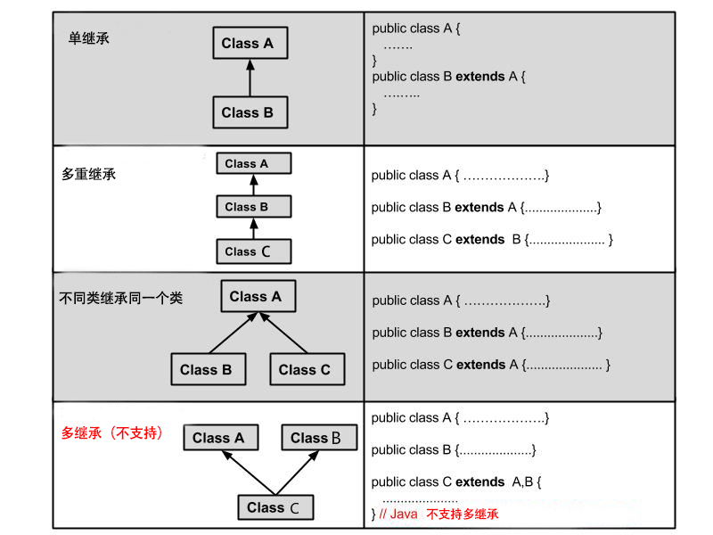

# Java编程语言
## Java语言基础
### 继承
#### 概念
+ 继承指的是子类继承父类的特征和行为，使得子类对象（实例）具有父类的实例域和方法，或者子类从父类继承方法，使得子类具有父类相同的行为
#### 继承的方式和作用
+ extends关键字实现子类继承父类
+ 具有父类当中的属性和方法，子类就不会存在重复的代码，维护性也提高，代码也更加简洁，提高代码的复用性（复用性主要是可以多次使用，不用再多次写同样的代码）
#### 继承规则
+ Java 的继承是单继承，但是可以多重继承，单继承就是一个子类只能继承一个父类，多重继承就是，例如 A 类继承 B 类，B 类继承 C 类，所以按照关系就是 C 类是 B 类的父类，B 类是 A 类的父类，这是 Java 继承区别于 C++ 继承的一个特性。

+ 子类拥有父类非 private 的属性、方法
+ 类可以拥有自己的属性和方法，即子类可以对父类进行扩展
#### 继承相关的关键字
  继承可以使用extends和implements这两个关键字来实现继承，而且所有的类都是继承于java.lang.Object，当一个类有继承的两个关键字，则默认继承Object类
+ **extends**: 在 Java 中，类的继承是单一继承，也就是说，一个子类只能拥有一个父类，所以 extends 只能继承一个类
```
public class Animal {
    private String name;
    private int id;
    public Animal(String myName, String myid) {
        //初始化属性值
    }
    public void eat() {  //吃东西方法的具体实现  }
    public void sleep() { //睡觉方法的具体实现  }
}

public class Penguin  extends  Animal{
}
```
+ **implements**: 使用implements关键字可以变相的使Java具有多继承的特性，使用范围为类继承接口的情况，可以同时继承多个接口（接口与接口之间用“，”隔开）
```
public interface A {
    public void eat();
    public void sleep();
}

public interface B {
    public void show();
}

public class C implements A,B {
}
```
+ **super与this关键字**：我们可以通过super关键字来实现对父类成员的访问，用来引用当前对象的父类；this是指向自己的引用。
```
class Animal {
  void eat() {
    System.out.println("animal : eat");
  }
}

class Dog extends Animal {
  void eat() {
    System.out.println("dog : eat");
  }
  void eatTest() {
    this.eat();   // this 调用自己的方法
    super.eat();  // super 调用父类方法
  }
}
```
+ **final关键字**：final声明类可以吧类定义为是不能继承的，即最终类；或者用于修饰方法，表示该方法不能被子类重写
+ **构造器（构造方法或者构造函数）**: 子类是不继承父类的构造器（构造方法或者构造函数）的，它只是调用（隐式或显式）。**如果父类的构造器带有参数**，则必须在子类的构造器中显式地通过 **super** 关键字调用父类的构造器并配以适当的参数列表;  **如果父类构造器没有参数**，则在子类的构造器中不需要使用 super 关键字调用父类构造器，系统会自动调用父类的无参构造器
```
class SuperClass {
  private int n;
  SuperClass(){
    System.out.println("SuperClass()");
  }
  SuperClass(int n) {
    System.out.println("SuperClass(int n)");
    this.n = n;
  }
}
// SubClass 类继承
class SubClass extends SuperClass{
  private int n;

  SubClass(){ // 自动调用父类的无参数构造器
    System.out.println("SubClass");
  }

  public SubClass(int n){
    super(300);  // 调用父类中带有参数的构造器
    System.out.println("SubClass(int n):"+n);
    this.n = n;
  }
}
// SubClass2 类继承
class SubClass2 extends SuperClass{
  private int n;

  SubClass2(){
    super(300);  // 调用父类中带有参数的构造器
    System.out.println("SubClass2");
  }

  public SubClass2(int n){ // 自动调用父类的无参数构造器
    System.out.println("SubClass2(int n):"+n);
    this.n = n;
  }
}
```
### Java 重写(Override)与重载(Overload)
####  重写(Override)
+ 重写是子类对父类的允许访问的方法的实现过程进行重新编写，**返回值和形参都不能改变**
+ 重写的好处在于子类可以根据需要，定义特定于自己的行为
+ 重写方法不能抛出新的检查异常或者比被重写方法申明更加宽泛的异常。*例如： 父类的一个方法申明了一个检查异常 IOException，但是在重写这个方法的时候不能抛出 Exception 异常，因为 Exception 是 IOException 的父类，只能抛出 IOException 的子类异常*。
#### 重写的规则
+ 参数列表必须完全与被重写的方法相同
+ 返回类型于被重写方法的返回类型可以不相同，但是必须是父类返回值的派生类
+ 访问权限不能比复父类中被重写的方法访问权限更低。***例：明为 public，那么在子类中重写该方法就不能声明为 protected***
+ 声明为 final 的方法不能被重写；声明为 static 的方法不能被重写，但是能够被再次声明
+ 子类和父类在同一个包中，那么子类可以重写父类所有方法，除了声明为 private 和 final 的方法；子类和父类不在同一个包中，那么子类只能够重写父类的声明为 public 和 protected 的非 final 方法
+ 构造方法不能被重写
+ 当需要在子类中调用父类的被重写的方法，要使用**super**关键字
#### 重载（overload)
+ 重载是指在**同一个类**中，方法名相同，而参数不同。返回的类型可以相同也可以不同。
+ 每个重载方法都必须有一个独一无二的参数类型列表
#### 重载的规则
+ 被重载的方法必须改变参数列表
+ 被重载的方法可以改变返回类型
+ 被重载的方法可以改变访问修饰符
+ 方法能够在同一个类中或者在一个子类中被重载
#### 重写与重载之间的区别
  方法的重写(Overriding)和重载(Overloading)是java多态性的不同表现，重写是父类与子类之间多态性的一种表现，重载可以理解成多态的具体表现形式。
+ (1)方法重载是一个类中定义了多个方法名相同,而他们的参数的数量不同或数量相同而类型和次序不同,则称为方法的重载(Overloading)。
+ (2)方法重写是在子类存在方法与父类的方法的名字相同,而且参数的个数与类型一样,返回值也一样的方法,就称为重写(Overriding)。
+ (3)方法重载是一个类的多态性表现,而方法重写是子类与父类的一种多态性表现。


### 多态
#### 概念
+ 多态是同一个行为具有多个不同表现形式或形态的能力。多态就是同一个接口，使用不同的实例而执行不同操作，意味着不同类的对象对同一消息做出不同的响应，随着父类在程序运行时实例化的对象不同，执行的行为不同。
#### 分类
+  1、编译时多态：设计时多态方法重载
+  2、程序运行时动态决定调用哪一个方法(JAVA中的多态)
#### 必要条件
+ 1、满足继承关系
+ 2、父类引用指向子类对象
+ 3、重写
#### 相关知识
+ **向上转型**（父类--->子类）（隐式转型、自动转型）：把子类的对象转型为父类对象，父类引用指向子类实例（例：Animal one = new Cat();）。可以调用子类重写父类的方法以及父类派生的方法，但无法调用子类独有的方法。（***注意：如果父类中有static修饰的方法，此方法是不允许被子类所重写，所以，向上转型之后，只能调用父类原有的静态方法，如果要调用子类的静态方法，只有再进行向下***）
+ **向下转型**（强制类型转换）：子类的引用指向父类对象，可以调用子类特有的方法。( 例：Cat temp = (Cat) one;）。
+ **instanceof判断符**：判断左边的对象是否是右边类的实例，如果是就返回true（例：if（one instanceof Cat) )。
#### 多态的实现方式
+ 重写
+ 接口
+ 抽象类和抽象方法
### 抽象类和抽象方法（abstract)
#### 抽象类
+ 在面向对象的概念中，所有的对象都是通过类来描绘的，但是反过来，并不是所有的类都是用来描绘对象的，如果一个类中没有包含足够的信息来描绘一个具体的对象，这样的类就是抽象类
+ ***抽象类不能直接实例化***，只能被继承，可以通过向上转型完成对象的实例化
+ 抽象类除了不能实例化对象之外，类的其它功能依然存在，成员变量、成员方法和构造方法的访问方式和普通类一样。
+ 由于抽象类不能实例化对象，所以抽象类必须被继承，才能被使用。也是因为这个原因，通常在设计阶段决定要不要设计抽象类。
#### 抽象方法
+ 如果你想设计这样一个类，该类包含一个特别的成员方法，该方法的具体实现由它的子类确定，那么你可以在父类中声明该方法为抽象方法
+ 不允许包含方法体：public obstract void eat();
+ 抽象类的子类必须给出抽象类中的抽象方法的具体实现，除非该子类也是抽象类。***注：这就是为什么需要定义抽象类和抽象方法，可以在创建子类时提示一定要重写父类里的某些抽象方法，不然就报错）***
+ 包含抽象方法的类一定是抽象类
+ *** 注：static 、final 、private不能与abstract并存,构造方法，类方法（用 static 修饰的方法）不能声明为抽象方法***
### 封装
#### 概念
+ 在面向对象程式设计方法中，封装（英语：Encapsulation）是指一种将抽象性函式接口的实现细节部分包装、隐藏起来的方法。
+ 封装可以被认为是一个保护屏障，防止该类的代码和数据被外部类定义的代码随机访问。
+ 要访问该类的代码和数据，必须通过严格的接口控制。
+ 封装最主要的功能在于我们能修改自己的实现代码，而不用修改那些调用我们代码的程序片段。
+ 适当的封装可以让程式码更容易理解与维护，也加强了程式码的安全性。
#### 使用
+ 修改属性的可见性来限制对属性的访问（一般限制为private）
+ 对每个值属性提供对外的公共方法访问，也就是创建一对赋取值方法，用于对私有属性的访问***(创建getter和setter方法, 任何要访问类中私有成员变量的类都要通过这些getter和setter方法。)***
### 接口（interface）
+ 接口在java程序中是一个抽象类型，是抽象方法的集合，通常用interface来声明。一个类通过继承接口的方式来继承接口的抽象方法。
+ 接口并不是类，编写接口的方式和类很相似，但是它们属于不同的概念。类描述对象的属性和方法。接口则包含类要实现的方法。
+ 除非实现接口的类是抽象类，否则该类要定义接口中的所有方法。
+ 接口无法被实例化，但是可以被实现。一个实现接口的类，必须实现接口内所描述的所有方法，否则就必须声明为抽象类。
#### 接口与类的区别
+ 接口不能实例化对象
+ 接口没有构造方法
+ 接口中所有方法必须都是抽象方法
+ 接口中不能包含成员变量，***除了  static  和  final 变量***
+ 接口不是被类继承了，而是要被类实现
+ 接口支持多继承
#### 接口的特性
+ 接口中每一个方法也是隐式抽象的,接口中的方法会被隐式的指定为 public abstract（只能是 public abstract，其他修饰符都会报错）。
+ 接口中可以含有变量，但是接口中的变量会被隐式的指定为 public static final 变量（并且只能是 public，用 private 修饰会报编译错误）
+ 接口中的方法是不能在接口中实现的，只能由实现接口的类来实现接口中的方法。
#### 抽象类和接口区别
+ 抽象类中的方法可以有方法体，就是能实现方法的具体特性，但是接口中的方法不行
+ 抽象类中的成员变量可以是各种类型，而接口中的成员变量只能是public static final类型的
+ ***一个类可以继承一个抽象类，但是一个类却可以实现多个接口***
#### 接口的声明
Interface关键字用来声明一个接口
```
[可见度] interface 接口名称 [extends 其他的接口名] {
        // 声明变量
        // 抽象方法
}
interface Animal {
   public void eat();
   public void travel();
}
```
#### 接口的实现
+ 当类实现接口的时候，类要实现接口中所有的方法。否则，类必须声明为抽象的类。
+ 类使用implements关键字实现接口。在类声明中，Implements关键字放在class声明后面。
```
...implements 接口名称[, 其他接口名称, 其他接口名称..., ...] ...

public class MammalInt implements Animal{

   public void eat(){
      System.out.println("Mammal eats");
   }

   public void travel(){
      System.out.println("Mammal travels");
   }
}
```
+ 重写接口中声明的方法时，类在重写方法时要保持一致的方法名，并且应该保持相同或者相兼容的返回值类型。
#### 接口的继承
+ 一个接口能继承另一个接口，和类之间的继承方式比较相似。接口的继承使用***extends***关键字，子接口继承父接口的方法
+ 在Java中，类的多继承是不合法，但接口允许多继承,在接口的多继承中extends关键字只需要使用一次，在其后跟着继承接口。
```
public interface Hockey extends Sports, Event
```
### 修饰符的访问范围
+ private: 只允许在本类中进行访问
+ public: 允许在任意位置进行访问
+ protected: 允许在当前类、同包子类、同包非子类、挎包子类中访问; ***挎包非子类不允许访问***
+ 默认情况下(不加以上三种修饰符之下)：允许在当前类、同包子类调用；***挎包子类不允许使用***


### Java StringBuffer 和 StringBuilder 类
+  当对字符串进行修改时，需要使用StringBuffer和StringBuilder类
+  与String不同的是，StringBuffer和StringBuilder类的对象能够多次被修改，并且不产生新的未使用对象
+  StringBuilder 类和 StringBuffer 之间的最大不同在于 StringBuilder 的方法不是线程安全的（不能同步访问）
+  由于 StringBuilder 相较于 StringBuffer 有速度优势，所以多数情况下建议使用 StringBuilder 类。然而在应用程序要求线程安全的情况下，则必须使用 StringBuffer 类

### Java集合框架
  Java 集合框架主要包括两种类型的容器，一种是集合（Collection），存储一个元素集合，另一种是图（Map），存储键/值对映射。Collection 接口又有 3 种子类型，List、Set 和 Queue，再下面是一些抽象类，最后是具体实现类，常用的有 ArrayList、LinkedList、HashSet、LinkedHashSet、HashMap、LinkedHashMap 等等
+ 接口：是代表集合的抽象数据类型。例如：Collocation、List、Set、Map等。之所以定义多个
+ 实现：是集合接口的具体实现，从本质上讲，它们是可以重复使用的数据结构，例如：ArratList、LinkedList、HashSet、HashMap。
#### 集合接口
+ Collection接口: 是最基本的集合接口,存储一组不唯一,无序的对象
+ List接口: 是一个有序的Collection,使用此接口能够精确地
+ Set接口: Set具有与Collection完全一样的接口,只是行为上不同,Set不保存重复的元素; Set接口存储一组唯一,无序的对象
+ Map接口: 存储一组键值对象,提供Key(键)到value(值)的映射
#### Set与List的区别
+ Set接口实例存储的是无序的,不重复的数据; List接口实例存储的是有序的,可以重复的数据
+ Set检索效率低下,删除和插入效率高,插入和删除不会引起元素位置的改变***(实现类有HashSet和TreeSet)***
+ List和数组类似,可以动态增长,根据实际存储的数据长度自动增长List长度.查找元素效率高,插入删除效率低,因为会引起其他元素位置改变***(实现类有ArrayLIst, LinkedList, Vector)***
#### 常用的集合类
+ ***List结构的集合类***: ArrayList类, LinkedList类, Vector类, Stack类
+ ***Map结构的集合类***: HashMap类, Hashtable类
+ ***Set结构的集合类***: HashSet类, TreeSet类
+ ***Queue结构的集合类***: Queue接口
#### 集合实现类(集合类)
+ ***LinkedList类***:
	+ 该类实现了List接口,允许有null元素.主要用于创建链表数据结构
	+ ***LinkedList的底层是一种双向循环链表***, LinkedList查找效率低但是增删效率高;
	+ 经常用在增删操作较多而查询操作很少的情况下：队列和堆栈 (实现栈要用LinkedList)
	+ 该类没有同步方法,如果多个线程同时访问一个List,则必须自己实现访问同步,解决方案是在创建List时候构造一个同步的List.例如:
```
List list = Collections.synchronizedList(new LinkedList(...))
```
+ ***ArrayList***:
	+ 该类实现了List的接口,实现可变大小的数组,随机访问和遍历元素时,提供更好的性能;
	+ ArrayList是异步的，因此ArrayList中的对象并不 是线程安全的;
	+ ***底层是Object数组***,所以ArrayList具有数组的查询速度快的优点以及增删速度慢的缺点;
	+ 同步要求会影响执行的效率，所以你不需要线程安全的集合那么使用ArrayList是一个很好的选择，这样可以避免由于同步带来的不必要的性能开销
+ ***Vector***:
	+ 该类与ArrayList非常相似,但是该类是同步的,可以用在多线程的情况下,该类允许设置默认的增长长度,默认扩容方式为原来的2倍
	+ Vector是同步的，这个类的一些方法保证了Vector中的对象的线程安全的
	+ 从内部实现的机制来讲，ArrayList和Vector都是使用数组（Array）来控制集合中的对象，当你向两种类型中增加元素的时候，如果元素的数目超过了内部数组目前的长度他们都需要扩展内部数组的长度，Vector缺省情况下自动增长原来一倍的数组长度，ArrayList是原来的50%，所以最后你获得的这个集合所占的空间总是比你实际需要的要大，所以如果你要在集合中保存大量的数据，那么使用Vector有一些优势，因为你可以通过设置集合的初始大小来避免不必要的资源开销
+ ***HashSet***:
	+ 采用哈希算法来实现Set接口
	+ 该类实现了Set接口,不允许重复的元素出现,不保证集合元素的顺序,允许包含值为null的元素,但最多只能包含一个
	+ 底层是数组,其查询效率也非常高
+ ***LinkedHashSet***: 具有可预知迭代顺序的Set接口的哈希表和链表实现
+ ***HashMap***:
	+ 是一个散列表,它存储的内容是键值对映射(Key-Value);
	+ 该类实现了Map接口,根据键的HashCode值存储数据,具有很快的访问速度,最多允许一个记录的键为null
	+ 轻量级,线程不安全,不支持多线程.HashMap则是异步的，因此HashMap中的对象并不是线程安全的;
	+ 同步的要求会影响执行的效率，所以如果你不需要线程安全的结合那么使用HashMap是一个很好的选择，这样可以避免由于同步带来的不必要的性能开销，从而提高效率，我们一般所编写的程序都是异步的
+***Hashtable***:
	+ 重量级,线程安全,Hashtable是同步的，这个类中的一些方法保证了Hashtable中的对象是线程安全的
	+ Hashtable是不能放入空值（null）的

+ ***Stack***: 栈是Vector的一个子类,它实现了一个标准的先进后出的栈
#### 如何使用迭代器(Iterator)
+ 通常情况下，你会希望遍历一个集合中的元素。例如，显示集合中的每个元素。
+ 一般遍历数组都是采用for循环或者增强for，这两个方法也可以用在集合框架，但是还有一种方法是采用迭代器遍历集合框架，它是一个对象，实现了Iterator 接口或ListIterator接口。
+ 迭代器，使你能够通过循环来得到或删除集合的元素。
```
Iterator<String> ite=list.iterator();
while(ite.hasNext())//判断下一个元素之后有值
{
	System.out.println(ite.next());
}
```
#### 总结
+ ArrayList: 元素单个，效率高，多用于查询
+ LinkedList:元素单个，多用于插入和删除
+ HashMap:   元素成对，元素可为空
+ HashTable: 元素成对，线程安全，元素不可为空
+ Vector:    元素单个，线程安全，多用于查询
+ 如果要求线程安全，使用Vector，Hashtable
+ 如果不要求线程安全，使用ArrayList，LinkedList，HashMap
+ 如果要求键值对，则使用HashMap，Hashtable
+ 如果数据量很大，又要求线程安全考虑Vector


### Java泛型
	  假定我们有这样一个需求：写一个排序方法，能够对整型数组、字符串数组甚至其他任何类型的数组进行排序，该如何实现？答案是可以使用 Java 泛型。
	  使用 Java 泛型的概念，我们可以写一个泛型方法来对一个对象数组排序。然后，调用该泛型方法来对整型数组、浮点数数组、字符串数组等进行排序。
#### 泛型方法
你可以写一个泛型方法，该方法在调用时可以接收不同类型的参数。根据传递给泛型方法的参数类型，编译器适当地处理每一个方法调用。下面是定义泛型方法的规则：
+ 所有泛型方法声明都有一个类型参数声明部分（由尖括号分隔），该类型参数声明部分在方法返回类型之前（在下面例子中的<E>）。
+ 每一个类型参数声明部分包含一个或多个类型参数，参数间用逗号隔开。一个泛型参数，也被称为一个类型变量，是用于指定一个泛型类型名称的标识符。
+ 类型参数能被用来声明返回值类型，并且能作为泛型方法得到的实际参数类型的占位符。
+ 泛型方法体的声明和其他方法一样。注意类型参数只能代表引用型类型，不能是原始类型（像int,double,char的等）。
```
public class GenericMethodTest
{
   // 泛型方法 printArray
   public static < E > void printArray( E[] inputArray )
   {
      // 输出数组元素
         for ( E element : inputArray ){
            System.out.printf( "%s ", element );
         }
         System.out.println();
    }

    public static void main( String args[] )
    {
        // 创建不同类型数组： Integer, Double 和 Character
        Integer[] intArray = { 1, 2, 3, 4, 5 };
        Double[] doubleArray = { 1.1, 2.2, 3.3, 4.4 };
        Character[] charArray = { 'H', 'E', 'L', 'L', 'O' };

        System.out.println( "整型数组元素为:" );
        printArray( intArray  ); // 传递一个整型数组

        System.out.println( "\n双精度型数组元素为:" );
        printArray( doubleArray ); // 传递一个双精度型数组

        System.out.println( "\n字符型数组元素为:" );
        printArray( charArray ); // 传递一个字符型数组
    }
}

```

#### 泛型类
泛型类的声明和非泛型类的声明类似，除了在类名后面添加了类型参数声明部分。和泛型方法一样，泛型类的类型参数声明部分也包含一个或多个类型参数，参数间用逗号隔开。一个泛型参数，也被称为一个类型变量，是用于指定一个泛型类型名称的标识符。因为他们接受一个或多个参数，这些类被称为参数化的类或参数化的类型。
```
public class Box<T> {

  private T t;

  public void add(T t) {
    this.t = t;
  }

  public T get() {
    return t;
  }

  public static void main(String[] args) {
    Box<Integer> integerBox = new Box<Integer>();
    Box<String> stringBox = new Box<String>();

    integerBox.add(new Integer(10));
    stringBox.add(new String("菜鸟教程"));

    System.out.printf("整型值为 :%d\n\n", integerBox.get());
    System.out.printf("字符串为 :%s\n", stringBox.get());
  }
}
```
#### 类型通配符
类型通配符一般是使用?代替具体的类型参数。例如 List<?> 在逻辑上List<String>,List<Integer> 等所有List<具体类型实参>的父类
```
import java.util.*;

public class GenericTest {

    public static void main(String[] args) {
        List<String> name = new ArrayList<String>();
        List<Integer> age = new ArrayList<Integer>();
        List<Number> number = new ArrayList<Number>();

        name.add("icon");
        age.add(18);
        number.add(314);

        getData(name);
        getData(age);
        getData(number);

   }

   public static void getData(List<?> data) {
      System.out.println("data :" + data.get(0));
   }
}

```

## 常见的设计模式及Java实现
### 单例模式
#### 概念
+ 单例模式是Java中最简单的设计模式之一.这种类型的设计模式属于创建型模式,它提供了一种创建对象的最佳方式
+ 这种模式涉及到一个的单一的类,该类负责创建自己的对象,同时确保只有的单个对象被创建.
+ 这个类提供了一种访问其唯一的对象的方式,可以直接访问,不需要实例化该类的对象.
####  介绍
+ ***意图***: 保证一个类仅有一个实例, 并且提供一个访问它的全局访问点
+ ***主要解决***: 一个全局使用的类频繁地创建和销毁
+ ***如何解决***: 判断系统是否已经有这个单例,如果有则返回, 如果没有则创建
+ ***关键代码***: 构造函数是私有的
+ ***优点***:
	+ 在内存中只有一个实例,减少了内存的开销,尤其是频繁的创建和销毁实例
	+ 避免对资源的多重占用
+ ***缺点***: 没有接口，不能继承，与单一职责原则冲突，一个类应该只关心内部逻辑，而不关心外面怎么样来实例化
#### 几种实现方式
##### 懒汉式(线程不安全)
+ 这种方式是最基本的实现方式，这种实现最大的问题就是不支持多线程。没有加锁 synchronized，这种方式 lazy loading 很明显，不要求线程安全，在多线程不能正常工作。。
```
public class SingLeton{
    //创建对象，不实例化
    private static SingLeton instance;
    //构造方法私有
    private SingLeton (){}
    //外部获取该类对象的方法(线程不安全的)
    pubilc static SingLeton getInstance(){
        if(instance == null){
            instance = new SingLeton();
        }
        return instance;
    }
}
```
##### 懒汉式(线程安全)
+ 这种方式具备很好的 lazy loading，能够在多线程中很好的工作，但是，效率很低，99% 情况下不需要同步。
+ 优点：第一次调用才初始化，避免内存浪费。
+ 缺点：必须加锁 synchronized 才能保证单例，但加锁会影响效率。
```
public class Singleton {
	//创建对象，不实例化
    private static Singleton instance;
    //构造方法私有
    private Singleton (){}
    //外部获取该类对象的方法(线程安全的)
    public static synchronized Singleton getInstance() {
        if (instance == null) {
            instance = new Singleton();
        }
        return instance;
    }
}
```
##### 饿汉式
+ 这种方式比较常用，但容易产生垃圾对象。在类中首先创建对象，再通过对外界提供静态方法将对象实例返回给外界使用
+ 优点：没有加锁，执行效率会提高。
+ 缺点：类加载时就初始化，浪费内存。
```
public class Singleton {
	//内部创建对象
    private static Singleton instance = new Singleton();
    //构造方法私有
    private Singleton (){}
    //外部获取该类对象的方法
    public static Singleton getInstance() {
    return instance;
    }
}
```
